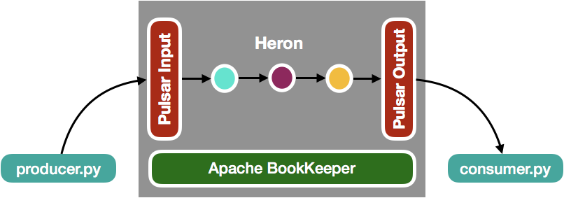

# The Streamlio sandbox

This repo houses all of the assets for the [Streamlio sandbox](https://streaml.io/docs/getting-started), a version of the Streamlio real-time messaging, compute, and stream storage platform tailored to local experimentation and development. The Streamlio sandbox combines three platforms---[Apache Pulsar](https://pulsar.incubator.apache.org) (incubating), [Heron](https://twitter.github.io/heron), and [Apache BookKeeper](https://bookkeeper.apache.org)---into a single Docker image, along with an example word count [Heron topology](https://twitter.github.io/heron/docs/concepts/topologies/). That topology does the following:

* consumes randomly chosen sentences published to a [Pulsar topic](http://pulsar.incubator.apache.org/docs/latest/getting-started/ConceptsAndArchitecture/#producers-consumers-topics-and-subscriptions) by a Pulsar [producer](producer.py)
* splits incoming sentences into individual words
* counts each word into an aggregated time interval
* periodically publishes those counts to a Pulsar topic that is then read by a [Pulsar consumer](consumer.py).

Below is a diagram of the sandbox:



The `producer.py` and `consumer.py` scripts are processes that you'll run outside the Docker container; the gray section in the middle shows everything inside the container.

## Requirements

### Docker

In order to run the Streamlio sandbox, you'll need to have a Docker engine running locally. You can find installation instructions for your platform below:

**MacOS**: [Download Link](https://docs.docker.com/docker-for-mac/install/)

**Windows**: [Download Link](https://docs.docker.com/docker-for-windows/install/)

**Ubuntu**: [Download Link](https://docs.docker.com/engine/installation/linux/docker-ce/ubuntu/)

> You can also run the sandbox image on a [Kubernetes](https://kubernetes.io) cluster using the instructions [below](#run-the-sandbox-on-kubernetes).

### Pulsar Client

The `consumer.py` and `producer.py` Python scripts require the `pulsar-client` library to run. You can install it using [pip](https://pip.pypa.io/en/stable/installing/):

```bash
pip install pulsar-client
```

## Run the sandbox image

The Docker image for the Streamlio sandbox is available via [Docker Hub](https://hub.docker.com/r/streamlio/sandbox/). You can run it using this command:

```bash
$ docker run -d \
  --name streamlio-sandbox \
  -p 9000:9000 \
  -p 8889:8889 \
  -p 6650:6650 \
  -p 8080:8080 \
  -p 8000:8000 \
  streamlio/sandbox
```

> If you'd prefer to build the Docker image from source rather than pulling from Docker Hub, see the [instructions below](#run-the-sandbox-image-from-source-files).

You can check to make sure the image is running using `docker ps`, which should output something like this:

```
CONTAINER ID        IMAGE               ...                                                                                              
c90100be5ea8        streamlio/sandbox   ...
```

### Ports Explanation

As you can see, the image requires several open ports. The table below examples what each port is used for.

| Component        | Host Port     | Docker Container Port |
| ---------------- | ------------- | --------------------- |
| Heron API Server | 9000          | 9000                  |
| Heron UI         | 8889          | 8889                  |
| Pulsar Broker    | 6650          | 6650                  |
| Pulsar Admin     | 8080          | 8080                  |
| Pulsar UI        | 8000          | 8000                  |

## Run the producer and consumer scripts

There are two Python scripts in the sandbox that act as a Pulsar producer and consumer, respectively. You can fetch them like this:

```bash
$ wget https://raw.githubusercontent.com/streamlio/sandbox/master/producer.py
$ wget https://raw.githubusercontent.com/streamlio/sandbox/master/consumer.py
```

If the Docker image is currently running, start up the consumer (just make sure to wait a few seconds after you've started up the Docker image):

```bash
$ python consumer.py
```

> If you get an error along the lines of `Exception: Pulsar error: ConnectError`, try waiting a few seconds and retrying. If that doesn't work, run `docker ps` to check on the status of the running image.

Initially, no messages will be published to the topic that the consumer is listening on. This will change when you start up the producer:

```bash
$ python producer.py
```

Once you start up the producer, you should begin to see messages like this via the consumer:

```
2017-08-13 16:23:44,561 INFO : Received message '{ "word" : "am" , "count" : 11 }'
2017-08-13 16:23:44,561 INFO : Received message '{ "word" : "an" , "count" : 11 }'
2017-08-13 16:23:44,563 INFO : Received message '{ "word" : "the" , "count" : 42 }'
2017-08-13 16:23:44,565 INFO : Received message '{ "word" : "doctor" , "count" : 11 }'
2017-08-13 16:23:44,565 INFO : Received message '{ "word" : "with" , "count" : 11 }'
2017-08-13 16:23:44,577 INFO : Received message '{ "word" : "moon" , "count" : 10 }'
2017-08-13 16:23:44,578 INFO : Received message '{ "word" : "at" , "count" : 11 }'
2017-08-13 16:23:44,578 INFO : Received message '{ "word" : "snow" , "count" : 11 }'
```

The producer, in turn, should be producing output like this:

```
2017-08-13 16:23:39,156 INFO : Sending message - four score and seven years ago
2017-08-13 16:23:39,217 INFO : Sending message - i am at two with nature
2017-08-13 16:23:39,277 INFO : Sending message - i am at two with nature
2017-08-13 16:23:39,338 INFO : Sending message - four score and seven years ago
2017-08-13 16:23:39,398 INFO : Sending message - an apple a day keeps the doctor away
2017-08-13 16:23:39,461 INFO : Sending message - the cow jumped over the moon
2017-08-13 16:23:39,524 INFO : Sending message - snow white and the seven dwarfs
```

If your output looks something like that, then the sandbox is working! That means that you now have an end-to-end, real-time, stateful processing platform powered by Apache Pulsar (incubating), Heron, and Apache BookKeeper running on your laptop.

## Examine the running topology

The [Heron UI](https://twitter.github.io/heron/docs/operators/heron-ui/) is a browser dashboard that you can use to examine numerous aspects of running topologies. While the Docker image is running, you can access the UI at http://localhost:8889. The Heron UI page for the word count topology should look like this:


## Examine Pulsar topics

You can get insight into Pulsar topics using the [Pulsar Dashboard](http://pulsar.incubator.apache.org/docs/latest/admin/Dashboard/). The sandbox uses two topics: `sentences` and `wordcount`. You can get info on those topics by navigating to http://localhost:8000/stats/namespace/sample/standalone/ns1 in your browser.

> The Pulsar Dashboard updates once every minute.

You can see the input and output topics in Pulsar:


You can also drill down into the stats of the input topic queue (named `sentences`):


We can also take a look at the `wordcount` topic, which contains word count results:


# Shut down and remove the image

Once you're finished experimenting with the Streamlio sandbox, you can kill the running container:

```bash
$ docker kill streamlio-sandbox
```

You can also remove the container at any time:

```bash
$ docker rm streamlio-sandbox
```

## Run the sandbox image from source files

If you prefer to build the Docker image from source rather than pulling from Docker Hub, follow the instructions below.

### Maven

Maven is required to build the Heron topology from source (the topology is written in Java). Please follow the instructions [here](https://maven.apache.org/install.html) if not present on your system.

### Clone the repo

```bash
$ git clone https://github.com/streamlio/sandbox.git
$ cd sandbox
```

### Build and copy the Heron Topology

```bash
$ mvn package
$ cp target/heron-starter-0.0.1-SNAPSHOT-jar-with-dependencies.jar ./docker/
```

### Build the Docker Image

```bash
$ docker build docker/ -t streamlio-sandbox:latest

# Check to make sure that the image has been installed
$ docker images
```

### Run a container based on the image

```bash
$ docker run -d \
  --name streamlio-sandbox \
  -p 9000:9000 \
  -p 8889:8889 \
  -p 6650:6650 \
  -p 8080:8080 \
  -p 8000:8000 \
  streamlio-sandbox:latest
```

Check that the image is running using `docker ps`.

## Run the sandbox on Kubernetes

You can run the Streamlio sandbox on a running Kubernetes cluster using just a few [`kubectl`](wget https://raw.githubusercontent.com/streamlio/sandbox/master/producer.py) commands. First, fetch the [YAML](http://www.yaml.io/) configuration:

```bash
$ wget https://raw.githubusercontent.com/streamlio/sandbox/kubernetes/streamlio-sandbox.yaml
```

Then apply the configuration to your cluster:

```bash
$ kubectl apply -f streamlio-sandbox.yaml
```

The `streamlio/sandbox` Docker image is fairly large, so it may take a minute or more to pull the image and start it up. You can check on the progress of the installation at any time:

```bash
$ kubectl get pods -l app=streamlio-sandbox
```

Once the `STATUS` changes to `RUNNING`, you can connect to the running pod using `kubectl`'s [`port-forward`](https://kubernetes.io/docs/tasks/access-application-cluster/port-forward-access-application-cluster/) command. First, get the name of the running pod by running the `kubectl get` command from above. Then open up the ports to that pod:

```bash
$ kubectl port-forward <pod name> 9000:9000 8889:8889 6650:6650 8080:8080 8000:8000
```