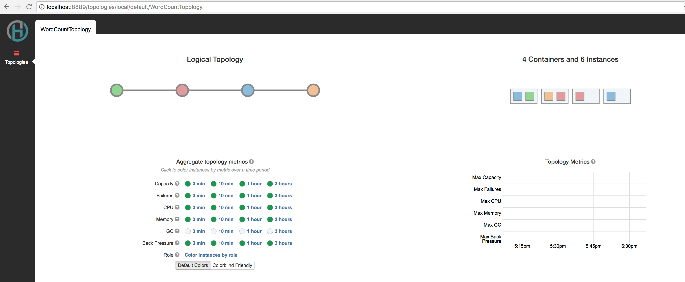
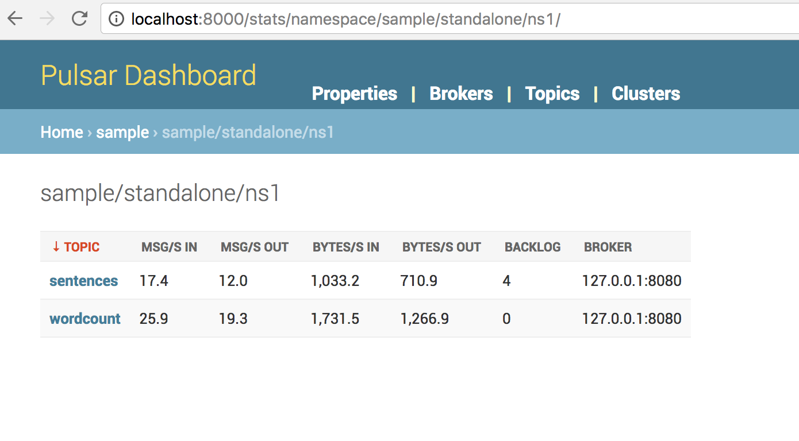
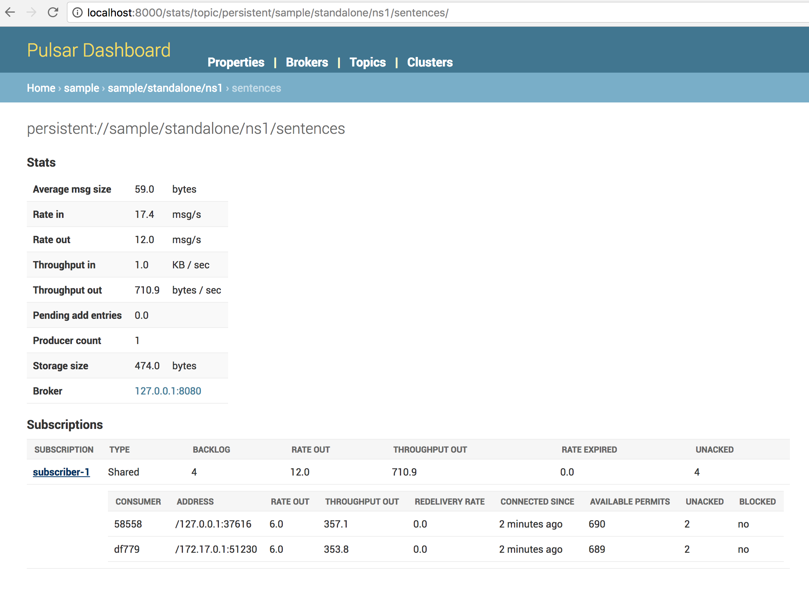
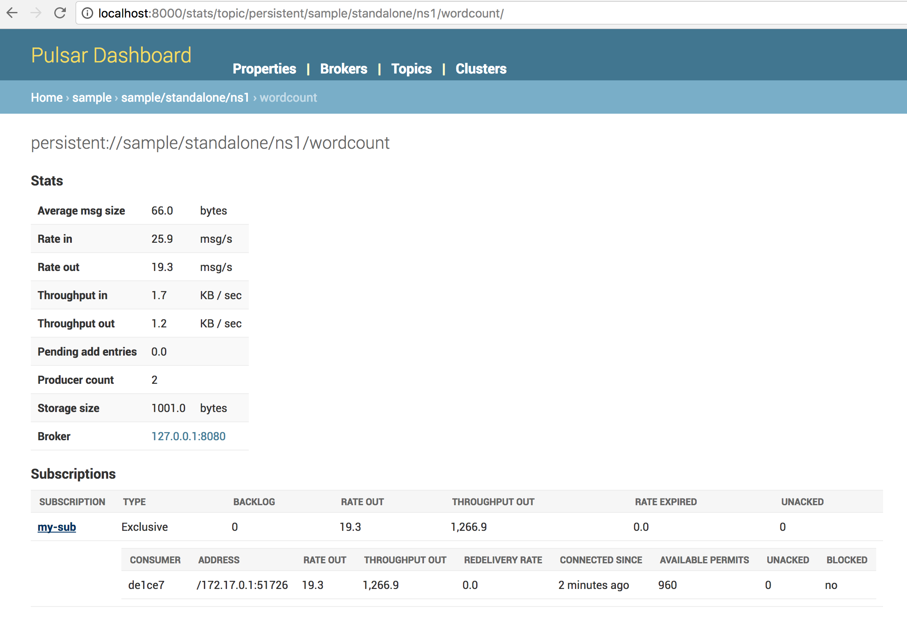

# Introduction

This is the repo for the sandbox for streamlio platform, it's a docker image that's running heron, pulsar, bookkeeper and a simple topology consuming messages which are a stream of sentences on a pulsar queue which get split into words and the aggregated in time window interval to a count map and then published to an output pulsar queue.

The docker image installs pulsar, heron and bookkeeper components and then packages and deploys the simple topology that is part of this repo.

Below is the diagram of the topology


# Requirements

### Docker

We require a docker engine running on a platform to build and deploy the container image. You can install it for your specific platform form the links below.

__OSX:__ [Download Link](https://docs.docker.com/docker-for-mac/install/)

__Windows:__ [Download Link](https://docs.docker.com/docker-for-windows/install/)

__Ubuntu:__ [Download Link](https://docs.docker.com/engine/installation/linux/docker-ce/ubuntu/)

### Maven

Maven is required to build the heron topology. Please follow instruction here if not present on system.

[Maven Installation](https://maven.apache.org/install.html)

### Pulsar Client

We require the pulsar python client for running the producer and consumer scripts.
It can be installed using the python package manager as below.

```bash
pip install pulsar-client
```

# Running the Sandbox Image from source files

### Clone the repo
```bash
git clone https://github.com/streamlio/sandbox.git
```

### Build and copy the Heron Topology
```bash
mvn package
cp target/heron-starter-0.0.1-SNAPSHOT-jar-with-dependencies.jar ./docker/
```

### Build the Docker Image
```bash
docker build docker/ -t streamlio-sandbox:latest
docker images
```

### Run a container based on the image
```bash
docker run -d --name streamlio-sandbox \
-p 9000:9000 -p 8889:8889 -p 6650:6650 -p 8080:8080 -p 8000:8000 streamlio-sandbox:latest
docker ps
```

# Running the Sandbox Image from dockerhub

### Run a container based on the image in docker hub
```bash
docker run -d --name streamlio-sandbox \
-p 9000:9000 -p 8889:8889 -p 6650:6650 -p 8080:8080 -p 8000:8000 streamlio/sandbox
docker ps
```

### Get and run the producer and consumer scripts

```bash
wget https://raw.githubusercontent.com/streamlio/sandbox/master/consumer.py && python consumer.py
```

```bash
wget https://raw.githubusercontent.com/streamlio/sandbox/master/producer.py && python producer.py
```

### Ports Explanation

| Component        | Host Port     | Docker Container Port |
| ---------------- | ------------- | --------------------- |
| Heron Api Server | 9000          | 9000                  |
| Heron UI         | 8889          | 8889                  |
| Pulsar Broker    | 6650          | 6650                  |
| Pulsar Admin     | 8080          | 8080                  |
| Pulsar UI        | 8000          | 8000                  |

# Examining Running Topology

Go to Heron Tracker UI [http://localhost:8889/](http://localhost:8889/)

We can see the topology running inside the docker container and its various stages



# Sending Input Events

Once the docker image is up and running we can start the [`producer`](producer.py) from the host to send messages to the pulsar instance in the docker container.

```bash
python producer.py
```

Sample Console output

```bash
2017-08-12 12:45:17,528 INFO : Connected to Pulsar
2017-08-12 12:45:17,528 INFO : Sending Messages ...
2017-08-12 12:45:17,583 INFO : Sending message - four score and seven years ago 
2017-08-12 12:45:17,764 INFO : Sending message - the cow jumped over the moon 
2017-08-12 12:45:17,821 INFO : Sending message - i am at two with nature 
2017-08-12 12:45:17,882 INFO : Sending message - an apple a day keeps the doctor away 
2017-08-12 12:45:17,945 INFO : Sending message - snow white and the seven dwarfs 
2017-08-12 12:45:18,004 INFO : Sending message - i am at two with nature 
2017-08-12 12:45:18,063 INFO : Sending message - an apple a day keeps the doctor away 
2017-08-12 12:45:18,127 INFO : Sending message - snow white and the seven dwarfs 
2017-08-12 12:45:18,187 INFO : Sending message - the cow jumped over the moon 
2017-08-12 12:45:18,246 INFO : Sending message - four score and seven years ago 
2017-08-12 12:45:18,303 INFO : Sending message - snow white and the seven dwarfs 
2017-08-12 12:45:18,366 INFO : Sending message - an apple a day keeps the doctor away 
2017-08-12 12:45:18,427 INFO : Sending message - the cow jumped over the moon
```

# Consuming Output Events

We can now start consuming the output stream with the [`consumer`](consumer.py) script


```bash
python consumer.py
```

Sample Console output

```bash
2017-08-12 16:59:12,742 INFO : Created consumer
2017-08-12 16:59:12,771 INFO : Received message '{ "word" : "away" , "count" : 12 }'
2017-08-12 16:59:12,771 INFO : Received message '{ "word" : "ago" , "count" : 13 }'
2017-08-12 16:59:12,772 INFO : Received message '{ "word" : "jumped" , "count" : 16 }'
2017-08-12 16:59:12,772 INFO : Received message '{ "word" : "seven" , "count" : 26 }'
2017-08-12 16:59:12,791 INFO : Received message '{ "word" : "cow" , "count" : 16 }'
2017-08-12 16:59:12,791 INFO : Received message '{ "word" : "two" , "count" : 10 }'
2017-08-12 16:59:12,791 INFO : Received message '{ "word" : "years" , "count" : 13 }'
2017-08-12 16:59:12,791 INFO : Received message '{ "word" : "dwarfs" , "count" : 13 }'
2017-08-12 16:59:12,791 INFO : Received message '{ "word" : "score" , "count" : 13 }'
2017-08-12 16:59:12,792 INFO : Received message '{ "word" : "apple" , "count" : 12 }'
2017-08-12 16:59:12,792 INFO : Received message '{ "word" : "white" , "count" : 13 }'
```
# Examine pulsar

Go to Pulsar-Dashboard [http://localhost:8000/stats/namespace/sample/standalone/ns1/](http://localhost:8000/stats/namespace/sample/standalone/ns1/)

__Note__ : The ui updates once every minutes

Here we can see the input and output topics in pulsar



We can drill down to the stats of the input topic queue



We can also examine the details of the output topic queue



# Shutdown and remove container

```bash
docker kill streamlio-sandbox
docker rm streamlio-sandbox
```
